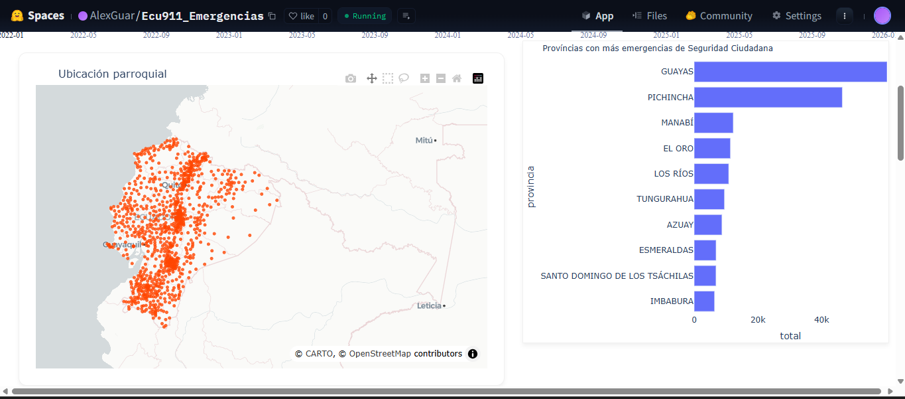

# 📊 Dashboard de Emergencias ECU911

 Análisis interactivo del reporte de emergencias recibido por parte del Servicio Integrado de Seguridad ECU911.

Objetivo: Reportar las diferentes categorías por incidentes que se producen en Ecuador.

Descripción: El dash permite buscar información por tipo de servicio, provincia y cantón.

[Demostración del Proyecto](https://huggingface.co/spaces/AlexGuar/Ecu911_Emergencias)

Se puede interactuar de la siguiente manera: 

